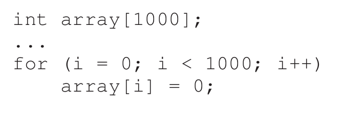
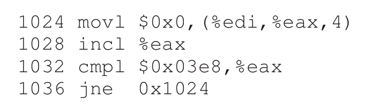
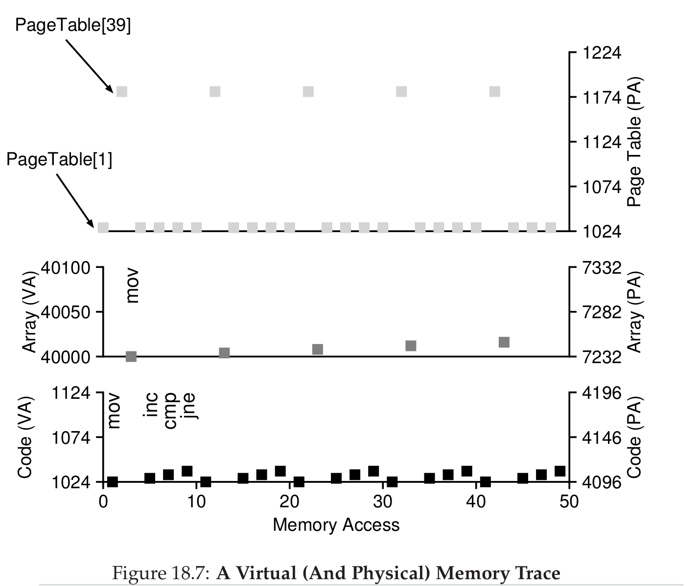

# Paging: Introduction (Kapitel 18)

**segmentation** -> variable size

**paging** -> fixed size

ein **page frame** entählt eine **page**  

**page table** speichert welche Seiten benutzt bzw frei sind und existiert 
pro Prozess. Er ist für die Adress übersetzung zuständig

**Übersetztung**

    VPN     Offset 
    biiiiiiiiiiiiiiiiiiits
    
    dann VPN im Pagetable nachschauen und durch PFN erstetzen
    
    PFN     Offset
    biiiiiiiiiiiiiiiiiiiits

**Page tables** werden im virtuellen OS memory gespeichert

- **Valid Bit** ungenutzte Pages werden im Page table als invalid markiert
- **Protection Bit** read write execute
- **Present Bit** ob im Memory oder auf der Disk
- **Dirty Bit** ob es bearbeitet wurde seit dem es im Memory ist
- **Reference Bit/Access Bit** ob kürzlich genutzt


- **Page-Table base register** start des page tables 


### Code

```shell

VPN = (VirtualAddress & VPN_MASK) >> SHIFT
PTEAddr = PageTableBaseRegister + (VPN + sizeof(PTE))

offset = VirtualAddress & OFFSET_MASK
PhysAddr = (PFN << SHIFT) | offset
```


#### Accessing Memory with Paging#

```shell
// Extract the VPN from the virtual address
VPN = (VirtualAddress & VPN_MASK) >> SHIFT

// Form the address of the page-table entry (PTE)
PTEAddr = PTBR + (VPN * sizeof(PTE))

// Fetch the PTE
PTE = AccessMemory(PTEAddr)

// Check if process can access the page
if (PTE.Valid == False)
  RaiseException(SEGMENTATION_FAULT)
else if (CanAccess(PTE.ProtectBits) == False)
  RaiseException(PROTECTION_FAULT)
else
  // Access is OK: form physical address and fetch it
  offset = VirtualAddress & OFFSET_MASK
  PhysAddr = (PTE.PFN << PFN_SHIFT) | offset
  Register = AccessMemory(PhysAddr)
```

#### Adressen trace

- file mit dem wir arbeiten
  -  


- **disassembled** mit objdump oder **otool**
  -  

- Virual and Physical Memory Trace
  -  


## Homework

```shell
./paging-linear-translate.py -P 1k -a 16k -p 32k -v -u 50 -c
ARG seed 0
ARG address space size 16k
ARG phys mem size 32k
ARG page size 1k
ARG verbose True
ARG addresses -1


The format of the page table is simple:
The high-order (left-most) bit is the VALID bit.
  If the bit is 1, the rest of the entry is the PFN.
  If the bit is 0, the page is not valid.
Use verbose mode (-v) if you want to print the VPN # by
each entry of the page table.

Page Table (from entry 0 down to the max size)
  [       0]  0x80000018
  [       1]  0x00000000
  [       2]  0x00000000
  [       3]  0x8000000c
  [       4]  0x80000009
  [       5]  0x00000000
  [       6]  0x8000001d
  [       7]  0x80000013
  [       8]  0x00000000
  [       9]  0x8000001f
  [      10]  0x8000001c
  [      11]  0x00000000
  [      12]  0x8000000f
  [      13]  0x00000000
  [      14]  0x00000000
  [      15]  0x80000008

Virtual Address Trace
  VA 0x00003385 (decimal:    13189) --> 00003f85 (decimal    16261) [VPN 12]
  VA 0x0000231d (decimal:     8989) -->  Invalid (VPN 8 not valid)
  VA 0x000000e6 (decimal:      230) --> 000060e6 (decimal    24806) [VPN 0]
  VA 0x00002e0f (decimal:    11791) -->  Invalid (VPN 11 not valid)
  VA 0x00001986 (decimal:     6534) --> 00007586 (decimal    30086) [VPN 6]

```


#### Berechnung

- Anzahl bits log2(Address-Space-Size)
  - log2(16384) = 14 Bits
- offset bits log2(Page-Size)
  - log2(1024) = 10 Bits
  - -> 4 bits VPN
- Address form hex to binär
  - 0x00003385 = 11 0011 1000 0101
  - VPN = 1100      Offset = 11100 00101
  - VPN = 12        Offset = 901
- Pagetable auf valide prüfen (erste Stelle auf 8)
  - PNF = 0xf
  - PNF = 15 = Binär = 1111
  - PNF + Offset = 1111 11 1000 0101 = Dec = 16261