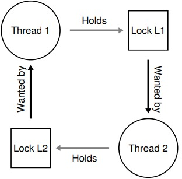
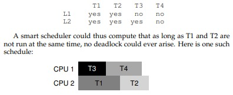

## 32 Common Concurrency Problems

The Crux of the Problem: Wie behandelt man die üblichen concurrency Probleme?

### 32.1 Arten von Bugs

Man hat in einer Studie, MySQL, Mozilla, Apache, und OpenOffice untersucht und herrausgefunden, dass von den gefunden Bugs, 30% durch Deadlocks und 70% anderweitig enstanden sind.
```bash
Application     What it does        Non-Deadlock Deadlock
MySQL           Database Server         14          9
Apache          Web Server              13          4
Mozilla         Web Browser             41          16
OpenOffice      Office Suite            6           2
Total                                   74          31
```

### 32.2 Non Deadlock Bugs

Non-Deadlock Bugs kann man in zwei Kategorien einteilen "Atomicity-Violation Bugs" und "Order-Violaton Bugs".

#### 32.2.1 Atomicity-Violation Bugs

Definition: "The desired serializability among multiple memory accesses
    is violated (i.e. a code region is intended to be atomic, but the atomicity
    is not enforced during execution)."

Diese Art von Bug ensteht wenn eine Critical Section nicht geschützt ist und zwei threads auf, beispielsweise den gleichen Pointer zugreifen, wobei einer der beiden Threads den Pointer
auf NULL setzt und der andere Thread versucht diesen zu verwenden. Wenn T1 nach dem NULL-Check unterbrochen wird und der Pointer von T2 auf NULL gesetzt wird endet die in einem Crash.
```bash
1 Thread 1::
2 if (thd->proc_info) {
3 fputs(thd->proc_info, ...);
4 }
5
6 Thread 2::
7 thd->proc_info = NULL;
```
**Lösung: Mutex/Locks/Semaphoren verwenden!**
#### 32.2.2 Order-Violation Bugs

Definition:  "The
desired order between two (groups of) memory accesses is flipped (i.e., A
should always be executed before B, but the order is not enforced during
execution)"

Dieser Bug ensteht beispielsweise wenn man davon ausgeht das T1 eine Variable bereits initialisiert hat und diese von T2 ohne überprüfung verwendet wird.
Wenn T2 läuft bevor T1 laufen konnte, versucht man in T2 auf einen nicht initialisierten Thread zuzugreifen.
```bash
1 Thread 1::
2 void init() {
3 mThread = PR_CreateThread(mMain, ...);
4 }
5
6 Thread 2::
7 void mMain(...) {
8 mState = mThread->State;
9 }
```
**Lösung: Condition Variables/Semaphoren verwenden!**
```bash
1 pthread_mutex_t mtLock = PTHREAD_MUTEX_INITIALIZER;
2 pthread_cond_t mtCond = PTHREAD_COND_INITIALIZER;
3 int mtInit = 0;
4
5 Thread 1::
6 void init() {
7 ...
8 mThread = PR_CreateThread(mMain, ...);
9
10 // signal that the thread has been created...
11 pthread_mutex_lock(&mtLock);
12 mtInit = 1;
13 pthread_cond_signal(&mtCond);
14 pthread_mutex_unlock(&mtLock);
15 ...
16 }
17
18 Thread 2::
19 void mMain(...) {
20 ...
21 // wait for the thread to be initialized...
22 pthread_mutex_lock(&mtLock);
23 while (mtInit == 0)
24 pthread_cond_wait(&mtCond, &mtLock);
25 pthread_mutex_unlock(&mtLock);
26
27 mState = mThread->State;
28 ...
29 }
```
### 32.3 Deadlock Bugs

Deadlock Bugs entstehen wenn beispielsweise zwei Threads versuchen zwei locks in unterschiedlicher Reihenfolge zu ergattern.
```bash
Thread 1:               Thread 2:
pthread_mutex_lock(L1); pthread_mutex_lock(L2);
pthread_mutex_lock(L2); pthread_mutex_lock(L1);
```
Sobald T1 nach dem ergattern von L1 unterbrochen wird und T2 sich L2 ergattert, sind beide Threads dazu gezwungen auf den jeweils anderen zu warten.
Dabei ist es wichtig zu bedenken, dass dies nicht immer der Fall sein muss und es vom Scheduler abhängt welcher thread zu welchem Zeitpunkt dran kommt.


Grund für das auftreten dieses Bugs ist die Größe und Komplexität von vielen Projekten. Beispiel: Das Betriebssystem. Der Virtuelle Memeroy Controller versucht eine Page auf die Disk zu schreiben
Das Filesystem benötigt eventuell eine Page um einen Block einlesen zu können und kontaktiert den Virtuellen Memory Controller und schon hat man ein Deadlock.
Ein weiterer Grund ist die Verkapselung. Da Programmierer so wenig Informationen wie möglich raus geben möchten, werden Funktionen o.ä. verschachtelt und leute welche diese Bibliothek
verwenden, wissen nicht wie die Reihenfolge innerhalb der Funktion implementiert wurde.

**Bedingungen für Deadlocks:**
```bash
Four conditions need to hold for a deadlock to occur:
• Mutual exclusion: Threads claim exclusive control of resources that
    they require (e.g., a thread grabs a lock).
• Hold-and-wait: Threads hold resources allocated to them (e.g., locks
    that they have already acquired) while waiting for additional resources (e.g., locks that they wish to acquire).
• No preemption: Resources (e.g., locks) cannot be forcibly removed
    from threads that are holding them.
• Circular wait: There exists a circular chain of threads such that each
    thread holds one or more resources (e.g., locks) that are being requested by the next thread in the chain.
```

Sobald eine dieser vier Bedingungen nicht erfüllt ist, kann kein Deadlock auftreten.

**Lösung 1: Circular Wait: Sicherstellen dass, GLOBAL alle Locks IMMER in gleicher Reihenfolge ergattert werden!**
Manchmal reicht auch schon das "Partial Ordering".
Eine mögliche umsetzung: Reihenfolge basiert auf der Adresse des Locks:
```bash
if (m1 > m2) { // grab in high-to-low address order
pthread_mutex_lock(m1);
pthread_mutex_lock(m2);
} else {
pthread_mutex_lock(m2);
pthread_mutex_lock(m1);
}
// Code assumes that m1 != m2 (not the same lock)
```
**Lösung 2: Hold and Wait: Hinzufügen eines weiteren Locks um das ergattern der Locks zu Garantieren.**

```bash
1 pthread_mutex_lock(prevention); // begin acquisition
2 pthread_mutex_lock(L1);
3 pthread_mutex_lock(L2);
4 ...
5 pthread_mutex_unlock(prevention); // end
```
**Lösung 3: No Preemption: Das freigeben eines locks wenn ein weiteres nicht zur verfügung steht.**
Da man oft mehrere Locks braucht und man während man wartet bereits ein Lock festhält für dies zum Deadlock. Damit das nicht passiert arbeiten viele mit Try-Locks und GoTo, was dafür sorgt das bei
fehlerhaften ergattern eines locks die anderen freigegeben werden und man kann es zu einem späteren Zeitpunkt erneut versuchen. Möglicherweise bringt das jedoch ein anderes Problem mit sich.
Das "**Live Lock**", Es kann passieren, dass mehrere Threads in der Trylock-schleife hängen und den vorgang mehrfach wiederholen, wodurch die CPU zwar ausgelastet ist, man aber keinen Fortschritt erhält. Diese Herangehensweise bringt noch andere Probleme mit sich und Skaliert nicht gut mit der Komplexität des Codes, da das freigeben der Locks auch immer komplexer wird. Auch wird
hierdurch keine echte "Preemption" hinzugefügt.
**Lösung 4: Avoid Mutal Exclusion: Lock and Wait Free.**
Die Idee ist es Datenstruckturen zu erstellen und zu verwenden welche auf Locks etc. verzichten und das Problem anderweitig lösen. Behold the powerfull... HARDWARE INSTRUCTIONS!
Beispiel: compare-and-swap instruktion
```bash
1 int CompareAndSwap(int *address, int expected, int new) {
2 if (*address == expected) {
3 *address = new;
4 return 1; // success
5 }
6 return 0; // failure
7 }
```
Beispiel für Atomic Increment:
```bash
1 void AtomicIncrement(int *value, int amount) {
2 do {
3 int old = *value;
4 } while (CompareAndSwap(value, old, old + amount) == 0);
5 }
```
Beispiel für Atomic Insert:
```bash
-------- UNGESCHÜTZT -------------
1 void insert(int value) {
2 node_t *n = malloc(sizeof(node_t));
3 assert(n != NULL);
4 n->value = value;
5 n->next = head;
6 head = n;
7 }
-------- MIT LOCKS -------------
1 void insert(int value) {
2 node_t *n = malloc(sizeof(node_t));
3 assert(n != NULL);
4 n->value = value;
5 pthread_mutex_lock(listlock); // begin critical section
6 n->next = head;
7 head = n;
8 pthread_mutex_unlock(listlock); // end critical section
9 }
-------- COMPARE-AND-SWAP -------------
1 void insert(int value) {
2 node_t *n = malloc(sizeof(node_t));
3 assert(n != NULL);
4 n->value = value;
5 do {
6 n->next = head;
7 } while (CompareAndSwap(&head, n->next, n) == 0);
8 }
```
Anstelle der verwendung von Locks, wird einfach überprüft ob die Listen in der zwischenzeit verändert wurde, falls ja wird die überprüfung und der Vorgang wiederholt und dann an den neuen
Kopf der Liste gesetzt.

**Lösung 5: Scheduling:**
Threads, welche zusammen einen Deadlock erstellen können, werden auf der gleichen CPU gescheduled. Dafür braucht man beim Schedulen die Info welche Threads, welche Locks brauchen.
Dadurch umgeht man das Problem eines Deadlocks zwar, allerdings zu kosten der Performance und der Parallelliesierung, da bestimmte Threads einfach nicht Parallel laufen können.


**Lösung 5: Detect and Recover:**
Für den Fall das ein Deadlock einmal im Jahr o.ä. auftritt, kann man dies einfach hin nehmen bzw. zulassen und statt dessen Vorkehrungen für diesen Fall treffen.
Wie zum Beispiel ein Server welcher im falle eines Deadlocks einfach neugestartet wird und die letzten bekannten Daten wiederhergestellt werden.

### 32.4 Fazit
Viele wegen führen ans Ziel und man muss sich den besten raus suchen, jenach dem ob einem Performance, Sicherheit oder Code-Komplexität wichtig ist. Oder auch: "Es kommt drauf an...."