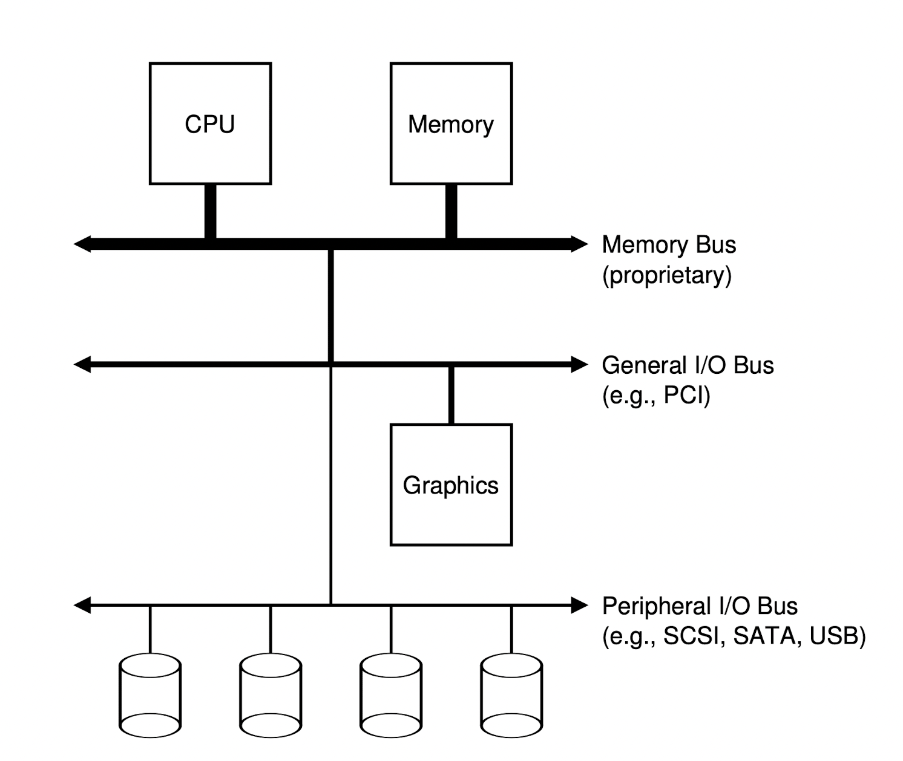

## 36 I/O Devices

**Crux: How to integrate I/O Devices?**

### 36.1 System Architecture

- single CPU attached to main memory
- some devices conntected via general I/O bus (in modern system would be PCI)
- lower down peripheral I/O bus such as USB
  - these connect slow devices to the system (disks, mice, keyboard...)
- why hierarchical structure?
  - physics and cost
  - components that demand high performance (graphic card) are nearer the CPU

### 36.2 A Canonical Device
- Interface: 
  - 
- two important components
  - hardware interface: it presents to the rest of the system 
  - internal structure: responsible for implementing the abstraction

### 36.3 The Canonical Protocol
- three registers: 
  - status register
  - command register
  - data register
- by reading and writing these registers, the os can control
device behavior
- typical interaction with os:
  
  - four steps: 
    - polling: os watis until the device is ready
    - os sends some date down to the data register
    - os writes command to command register
    - os waits for device to finish by again polling
- simple and working but polling is inefficient and waste cpu time

### 36.4 Lowering CPU Overhead with Interrupts
- instead of polling, os can issue request, put calling process to sleep, 
and  context switch to another task
- when device is finished, it will raise hardware interrupt
-> causing cpu to jump into interrupt handler.
- handler will finish request and wake process waiting for I/O, 
wich then can proceed

### 36.5 More Efficient Data Movement with DMA
- problem: when using programmed I/O (PIO) to transfer a large chunk of data
- how to lower PIO overheads?
  - -> Direct Memory Access (DMA) 
- telling DMA where data lives in mem, how much data to copy, wich device to send to it

### 36.6 Methods of Device Interaction 
- how to commucicate with devices?
- first: explicit I/O instructions
  - these instructions specify a way for the os to send data to 
  specific device registers
  - such instructions are privileged
- second: memory-mapped I/O
  - hardware makes device registers available as if they were mem locations
  - os issues a load (to read) or a store (wo write) the adress

### 36.7 Fitting Into The OS: The Device Driver
- how to build a device-neutral OS? -> abstraction!

### 36.8 Case Study: A Simple IDE Disk Driver

- 6 steps:
  - wait for drive to be ready
  - write parameters to command registers
  - start the I/O
  - data transer (for writes)
  - handle interrupts
  - error handling

### 36.10 Summary
- two techniques, the interrupt and DMA, habe been introduced
to help with device efficiency
- two approaches to accesing device register, explicit I/O instuctions
and memory-mapped I/O