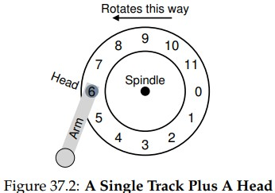

## 37 Hard Disk Drives

### 37.1 The Interface
- drive consists large number of sectors
  (512 bytes) each of which can be read or written
- single 512 byte write is atomic

### 37.2 Basic Geometry

- components: 
  - platter: circular hard surface which data is stored
  - platters are bound together around the spindle
  - track: concentric circles of sectors
  - disk head: accomplishes read and write ops
  - disk arm: moves disk head
- rate of rotations measured in rotations per minute (rpm)
    - typical value from 7200 to 15000 rpm

### 37.3 A Simple Disk

### 37.4 I/O Time: Math
- TI/O = Tseek + Trotation + Ttransfer
- use disk sequentially!
- huge gap in drive performance between random
and sequential workloads
### 37.5 Disk Scheduling
- SSTF: Shortest Seek Time First
  - orders the queue of I/O requests by track, 
  picking requests on the nearest track to complete first
  - not realistic, drive geometry is not available,
  instead of sstf, os can implement nearest-block-first (NBF)
  - problem: starvation
- Elevator (a.k.a. SCAN or C-SCAN)
  - sweep: single pass across the disk
  - simply moves back and forth across disk
  servicing requests in order across the tracks
  - F-SCAN: freezes queue when doing a sweep
  - C-SCAN: instead of sweeping in both directions, 
  algorithm only sweeps from outer to inner
- SPTF: Shortest Positioning Time First
  - works as named
  - sometimes not good enough -> it depends
  - depends on relative time of seeking compared to ratation
  - if seek time is much higher than rotational delay
  then sstf are just fine

- other Scheduling Issues
  - where is disk scheduling performed on modern systems?
    - in older systems, the os did all the scheduling
    - in modern systems, disks can accommodate multiple outstanding
    requests
  - another task performed by disk scheduler: I/O merging
    - imagine: requestted blocks: 33,8,34 
    then scheduler should merge 33,34 into single two block request
  - how long should system wati before issuing an I/O to disk?
    - work-conserving: os issues immediately
    - not-work-conserving: wait a little before issuing 

### Homework: disk.py

